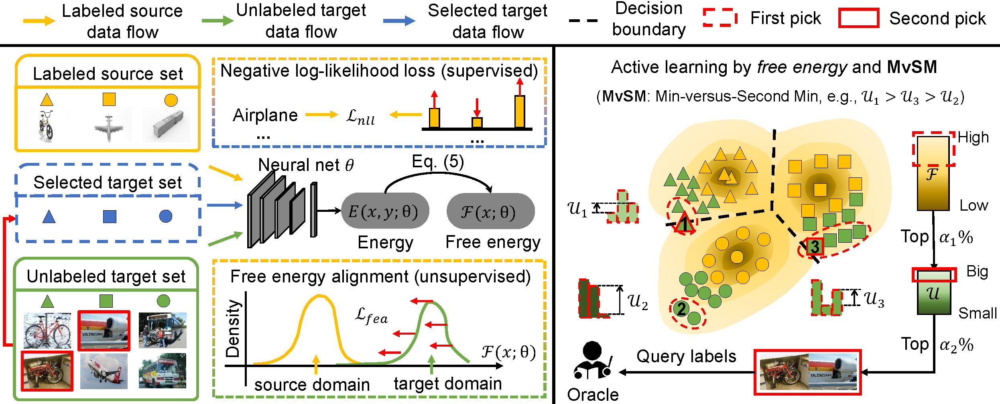

# Active Learning for Domain Adaptation: An Energy-based Approach

**[[Arxiv](https://arxiv.org/abs/2112.01406)]**
**[[Paper](https://arxiv.org/pdf/2112.01406.pdf)]**

Unsupervised domain adaptation (UDA) has recently emerged as an effective paradigm for generalizing deep neural networks to new target domains. However, there is still enormous potential to be tapped to reach the fully supervised performance. 

We start from an observation that energy-based models exhibit free energy biases when training (source) and test (target) data come from different distributions. Inspired by this inherent mechanism, we empirically reveal that a simple yet efficient energy-based sampling strategy sheds light on selecting the most valuable target samples than existing approaches requiring particular architectures or computation of the distances. 

Our algorithm, Energy-based Active Domain Adaptation (EADA), queries groups of target data that incorporate both domain characteristic and instance uncertainty into every selection round. Meanwhile, by aligning the free energy of target data compact around the source domain via a regularization term, domain gap can be implicitly diminished. 



Through extensive experiments, we show that EADA surpasses state-of-the-art methods on well-known challenging benchmarks with substantial improvements, making it a useful option in the open world.

For more information on EADA, please check our **[[Paper](https://arxiv.org/pdf/2112.01406.pdf)]**.

If you find this project useful in your research, please consider citing:

```bib
@inproceedings{xie2022eada,
  title={Active Learning for Domain Adaptation: An Energy-based Approach},
  author={Binhui Xie, Longhui Yuan, Shuang Li, Chi Harold Liu, Xinjing Cheng, Guoren Wang},
  booktitle={Thirty-Sixth AAAI Conference on Artificial Intelligence (AAAI-22)},
  pages={},
  year={2022}
}
```


##  Setup Environment

For this project, we used python 3.7.5. We recommend setting up a new virtual environment:

**Step-by-step installation**

```bash
conda create --name activeDA -y python=3.7
conda activate activeDA

# this installs the right pip and dependencies for the fresh python
conda install -y ipython pip

pip install -r requirements.txt
```

### Setup Datasets
- Download [The Office-31 Dataset](https://faculty.cc.gatech.edu/~judy/domainadapt/)
- Download [The Office-Home Dataset](http://hemanthdv.org/OfficeHome-Dataset/)
- Download [The VisDA-2017 Dataset](https://github.com/VisionLearningGroup/taskcv-2017-public/tree/master/classification)

The data folder should be structured as follows:
```
├── data/
│   ├── office31/	
|   |   ├── amazon/
|   |   ├── dslr/
|   |   ├── webcam/	
│   ├── home/     
|   |   ├── Art/
|   |   ├── Clipart/
|   |   ├── Product/
|   |   ├── RealWorld/
│   ├── visda2017/
|   |   ├── train/
|   |   ├── validation/
│   └──	
```

Symlink the required dataset
```
ln -s /path_to_office31_dataset data/office31
ln -s /path_to_home_dataset data/home
ln -s /path_to_visda2017_dataset/clf/ data/visda2017
```

## Running the code

For Office-31
```
python main.py --cfg configs/office.yaml
```

For Office-Home
```
python main.py --cfg configs/home.yaml
```

For VisDA-2017
```
python main.py --cfg configs/visda2017.yaml
```

## Acknowledgements

This project is based on the following open-source projects. We thank their authors for making the source code publicly available.
- [Transferable-Query-Selection](https://github.com/thuml/Transferable-Query-Selection)

## Contact

If you have any problem about our code, feel free to contact

- [binhuixie@bit.edu.cn](mailto:binhuixie@bit.edu.cn)

or describe your problem in Issues.
